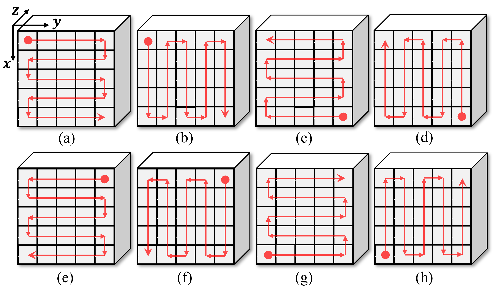

# Multiscanning-strategy
The python code for the multiscanning strategy.

The scanning style can be refered in "W. Zhou, S. -i. Kamata, Z. Luo and H. Wang, "Multiscanning Strategy-Based Recurrent Neural Network for Hyperspectral Image Classification," in IEEE Transactions on Geoscience and Remote Sensing, vol. 60, pp. 1-18, 2022, Art no. 5521018, doi: 10.1109/TGRS.2021.3138742." (https://ieeexplore.ieee.org/document/9663304)

**Please kindly cite the papers if this code is useful and helpful for your research.**

zhouweilian1904@akane.waseda.jp

